# 🚗 Sistema de Autoescola

## Documentação de Arquitetura de Software

---

### 🚀 Bem-vindo(a) à documentação do Projeto AutoGest!

Este repositório serve como um hub central para toda a documentação de arquitetura, design e modelagem do software **Sistema de Autoescola**. Aqui, você encontrará uma coleção abrangente de diagramas UML e outros artefatos visuais que detalham a estrutura, o comportamento e as interações do sistema, fornecendo uma visão clara e estruturada para todos os stakeholders envolvidos.

### 📚 Índice

* [Visão Geral da Documentação](#-visão-geral-da-documentação)
* [Diagrama de Arquitetura](#-diagrama-de-arquitetura)
* [Diagrama de Caso de Uso](#-diagrama-de-caso-de-uso)
* [Diagrama de Classe](#-diagrama-de-classe)
* [Diagrama de Componentes](#-diagrama-de-componentes)
* [Diagramas de Comunicação](#-diagramas-de-comunicação)
    * [Comunicação: Cadastro de Aluno (UC-01)](#diagrama-de-comunicação-cadastro-de-aluno-uc-01)
    * [Comunicação: Visualizar Relatórios (UC-09/10)](#diagrama-de-comunicação-visualizar-relatórios-uc-0910)
* [Diagramas de Estados](#-diagramas-de-estados)
    * [Estados: Status de Matrícula do Aluno](#diagrama-de-estados-status-de-matrícula-do-aluno)
    * [Estados: Aula Prática](#diagrama-de-estados-aula-prática)
* [Diagrama de Implantação](#-diagrama-de-implantação)
* [Diagrama de Modelo de Dados](#-diagrama-de-modelo-de-dados)
* [Diagramas de Sequência](#-diagramas-de-sequência)
    * [Sequência: Cadastrar Novo Aluno (UC-01)](#diagrama-de-sequência-cadastrar-novo-aluno-uc-01)
    * [Sequência: Marcar Presença (UC-06)](#diagrama-de-sequência-marcar-presença-uc-06)
    * [Sequência: Visualizar Relatório (UC-09/10)](#diagrama-de-sequência-visualizar-relatório-uc-0910)
    * [Sequência: Agendar Aula Prática (UC-05)](#diagrama-de-sequência-agendar-aula-prática-uc-05)
    * [Sequência: Cadastro de Funcionário (UC-02)](#diagrama-de-sequência-cadastro-de-funcionário-uc-02)
    * [Sequência: Visualizar Agenda (UC-07)](#diagrama-de-sequência-visualizar-agenda-uc-07)
* [Outros Artefatos](#-outros-artefatos)

---

### 💡 Visão Geral da Documentação

Cada seção abaixo contém um diagrama específico acompanhado de uma breve descrição do seu propósito e do que ele representa no contexto do sistema **Sistema de Autoescola**.

---

### 🏛️ Diagrama de Arquitetura

Este diagrama (C4 Nível 2) ilustra a estrutura de alto nível do sistema **Sistema de Autoescola**, mostrando os principais contêineres (aplicações, microsserviços, bancos de dados) e suas interações fundamentais. Ele fornece uma visão macro da organização do software.

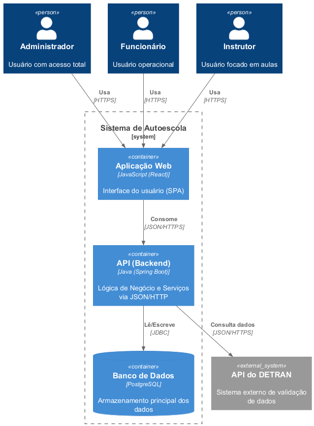

---

### 👥 Diagrama de Caso de Uso

Apresenta os casos de uso principais do sistema **Sistema de Autoescola**, identificando os atores (Administrador, Funcionário, Instrutor) e as funcionalidades que eles podem executar, descrevendo o comportamento externo do sistema.

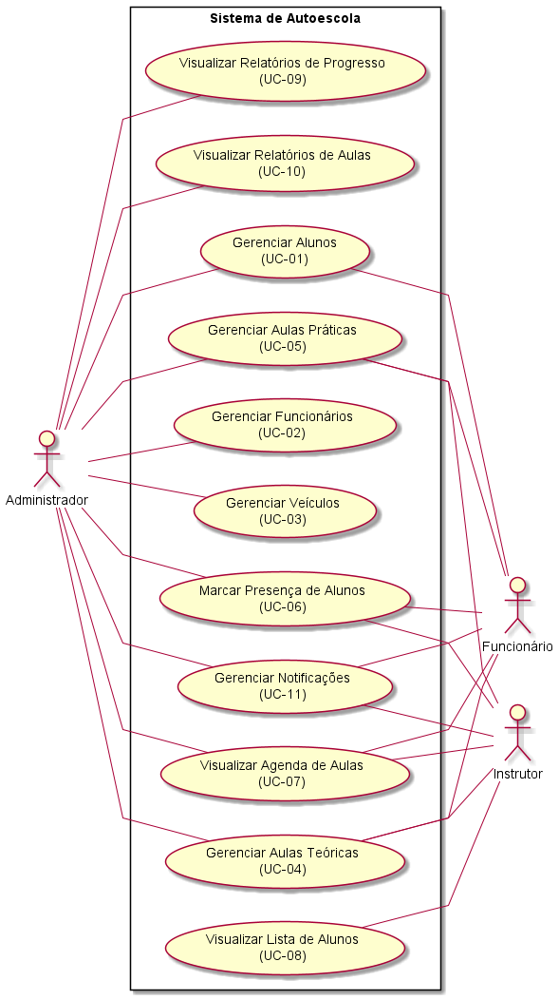

---

### 🧱 Diagrama de Classe

Detalha as classes do sistema, seus atributos, métodos e os relacionamentos estáticos (associações) entre elas, representando a estrutura estática do projeto.

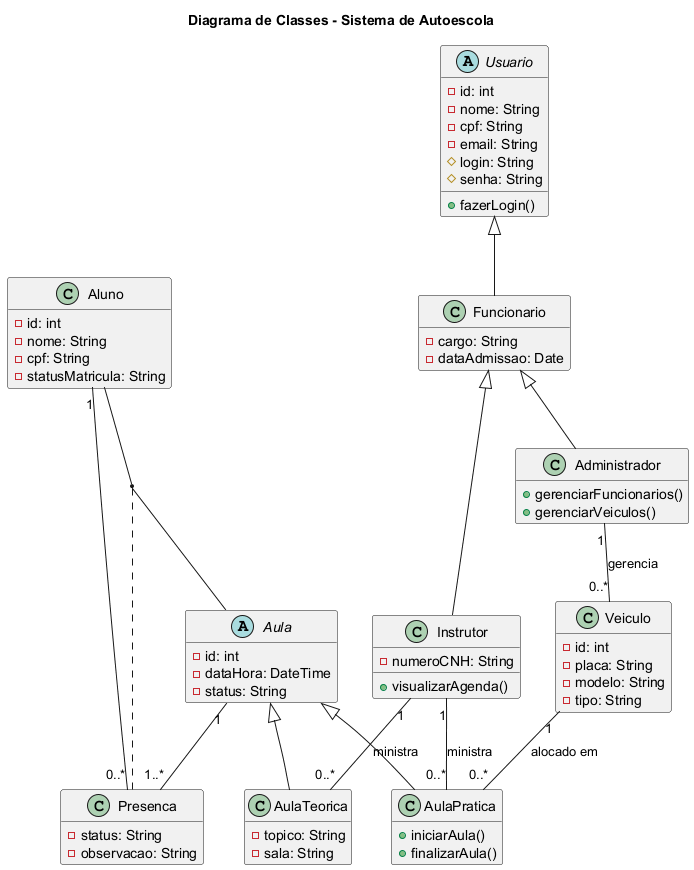

---

### 🧩 Diagrama de Componentes

Exibe a organização e a dependência dos componentes de software, fornecendo uma visão modular do sistema e como as diferentes partes lógicas se encaixam e interagem.

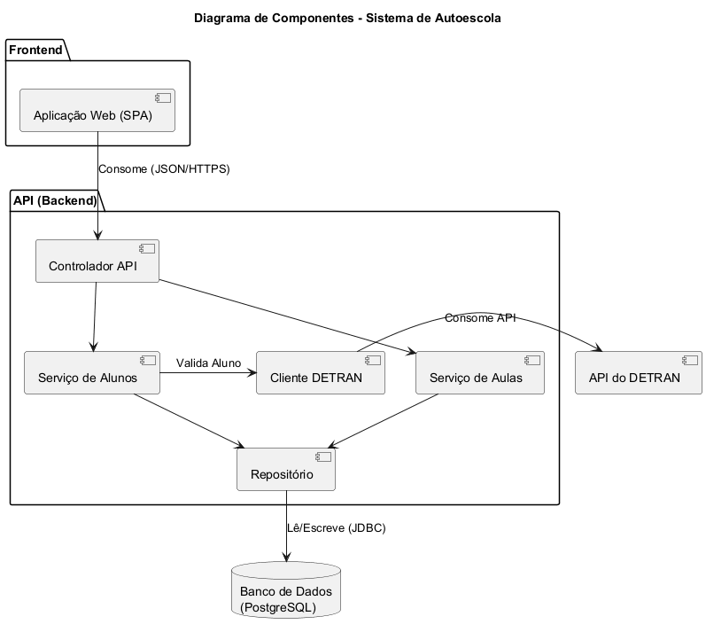

---

### 💬 Diagramas de Comunicação

Estes diagramas mostram a interação entre objetos e componentes em um determinado cenário, focando na troca de mensagens numeradas e na colaboração para atingir um objetivo específico.

#### Diagrama de Comunicação: Cadastro de Aluno (UC-01)

Detalha as interações necessárias para o processo de cadastro de um novo aluno no sistema.

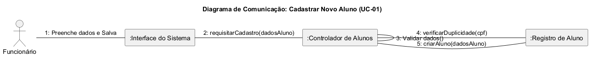

#### Diagrama de Comunicação: Visualizar Relatórios (UC-09/10)

Detalha as interações dos componentes do sistema para que os usuários possam visualizar relatórios de progresso e de aulas.

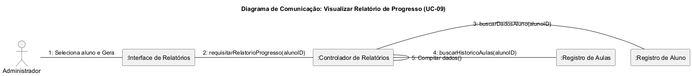

---

### 🔄 Diagramas de Estados

Representam os diferentes estados que os objetos podem ter ao longo do tempo e as transições entre esses estados em resposta a eventos específicos.

#### Diagrama de Estados: Status de Matrícula do Aluno

Representa os diferentes estados que a matrícula de um aluno pode ter (ex: `Pendente`, `Ativa`, `Suspensa`, `Cancelada`) e as transições entre esses estados.

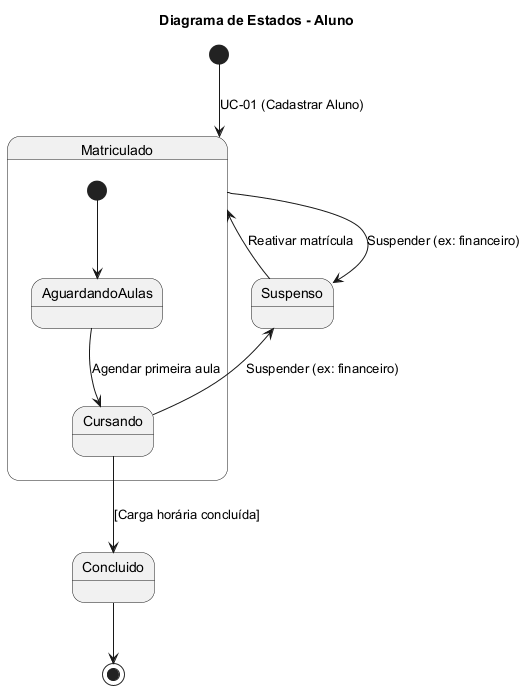

#### Diagrama de Estados: Aula Prática

Representa os diferentes estados que uma aula prática pode ter (ex: `Agendada`, `Em Andamento`, `Concluída`, `Cancelada`) e as transições entre esses estados.

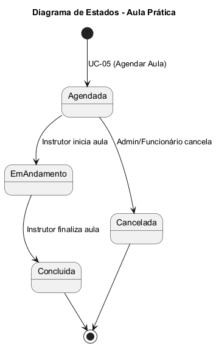

---

### 🚀 Diagrama de Implantação

Descreve a configuração física de hardware em nuvem onde o software será executado, incluindo os nós (Servidor da Aplicação, Servidor de Arquivos) e os componentes de software implantados neles.

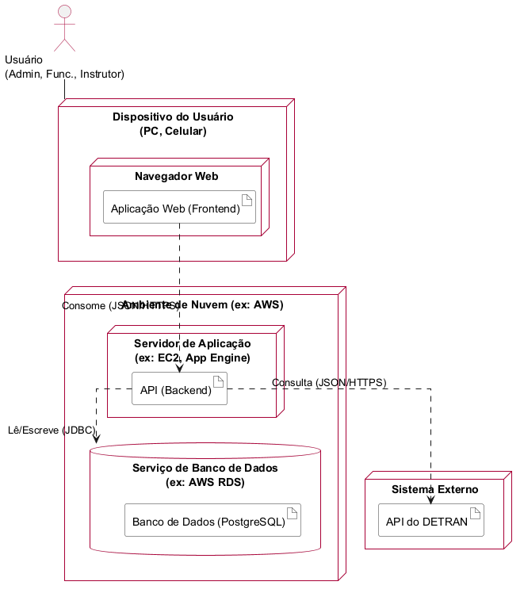

---

### 💾 Diagrama de Modelo de Dados

Ilustra a estrutura lógica do banco de dados (ERD), mostrando as entidades (tabelas), seus atributos (colunas) e os relacionamentos (`<PK>`, `<FK>`) entre elas.

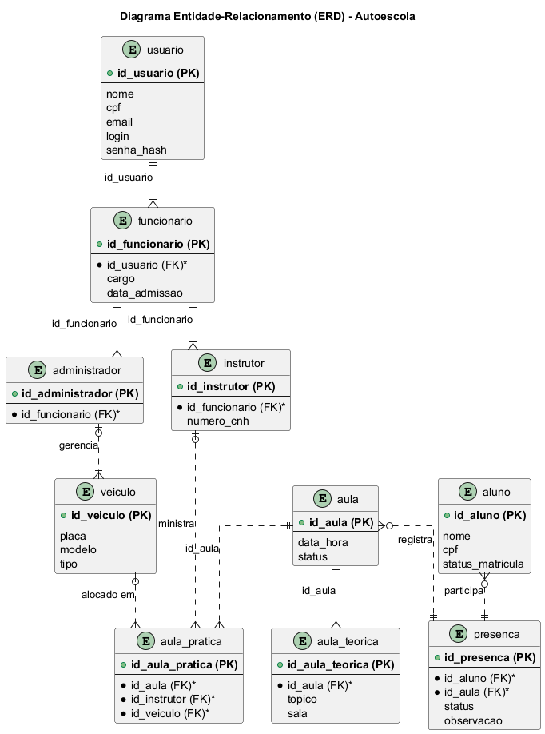

---

### ⏳ Diagramas de Sequência

Estes diagramas detalham a ordem cronológica das interações e a troca de mensagens entre objetos ou atores para realizar uma funcionalidade específica, mostrando a vida útil de cada participante.

#### Diagrama de Sequência: Cadastrar Novo Aluno (UC-01)

Representa o fluxo de eventos e mensagens para o cadastro de um novo aluno no sistema.

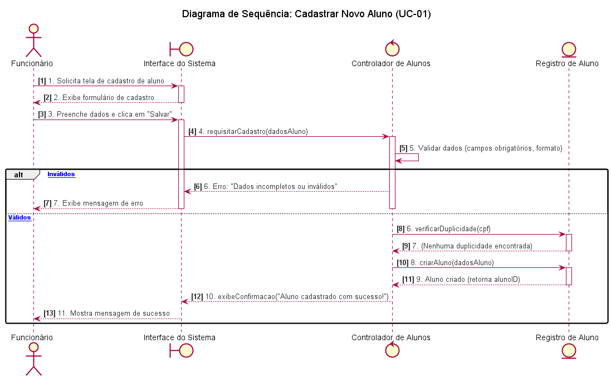

#### Diagrama de Sequência: Marcar Presença (UC-06)

Mostra a sequência de interações para o processo de marcação de presença de alunos em aulas.

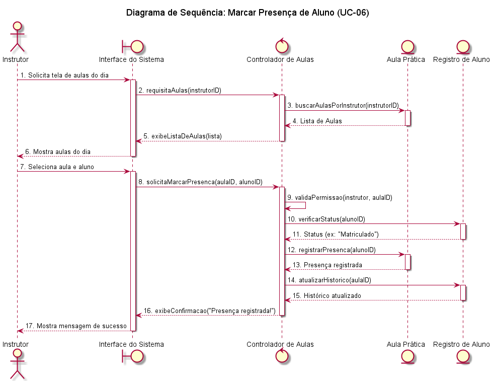

#### Diagrama de Sequência: Visualizar Relatório (UC-09/10)

Ilustra o fluxo de eventos e mensagens para a visualização de relatórios de progresso e de aulas.

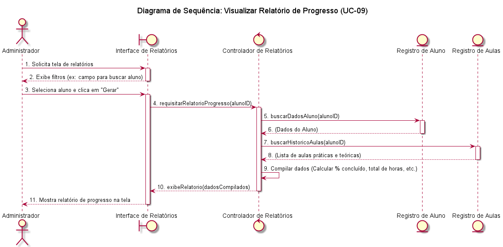

#### Diagrama de Sequência: Agendar Aula Prática (UC-05)

Representa o fluxo de eventos e mensagens para o agendamento de uma nova aula prática.

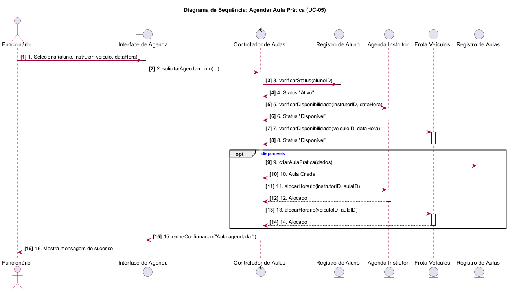

#### Diagrama de Sequência: Cadastro de Funcionário (UC-02)

Ilustra o fluxo de eventos e mensagens para o cadastro de um novo funcionário no sistema.

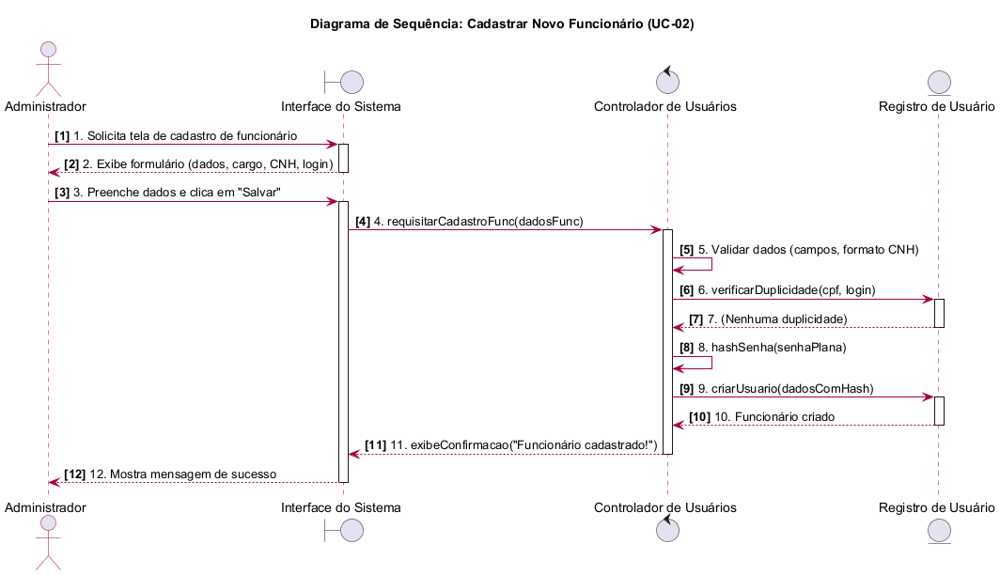

#### Diagrama de Sequência: Visualizar Agenda (UC-07)

Mostra a sequência de interações para a visualização da agenda de aulas pelos usuários.

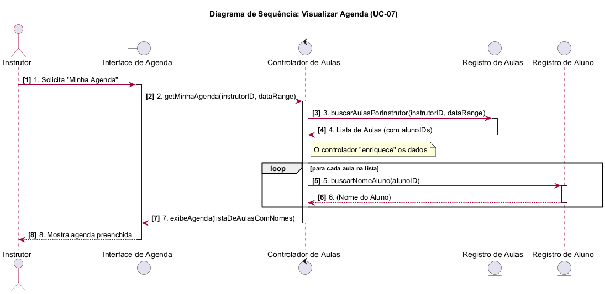

---

### 📝 Outros Artefatos

* **Códigos PlantUML:** Todos os arquivos fonte dos diagramas estão disponíveis na pasta `CodesPlantUML/` para edição e manutenção.

* **Histórico de Revisões:** Documenta o versionamento e as alterações realizadas ao longo do desenvolvimento da arquitetura.

